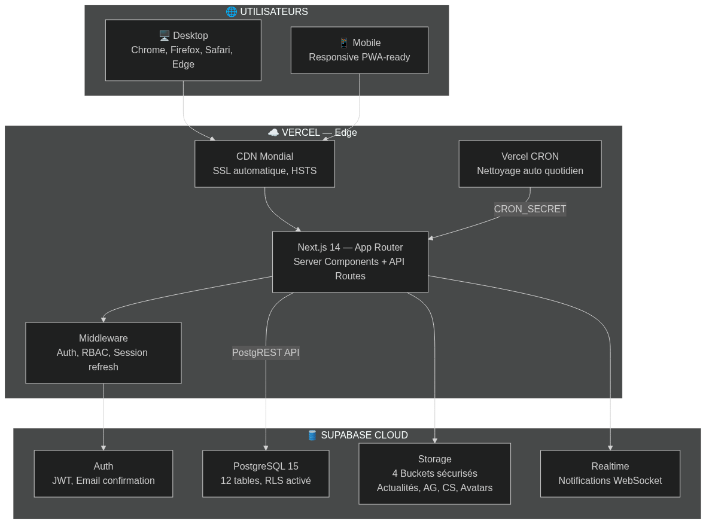
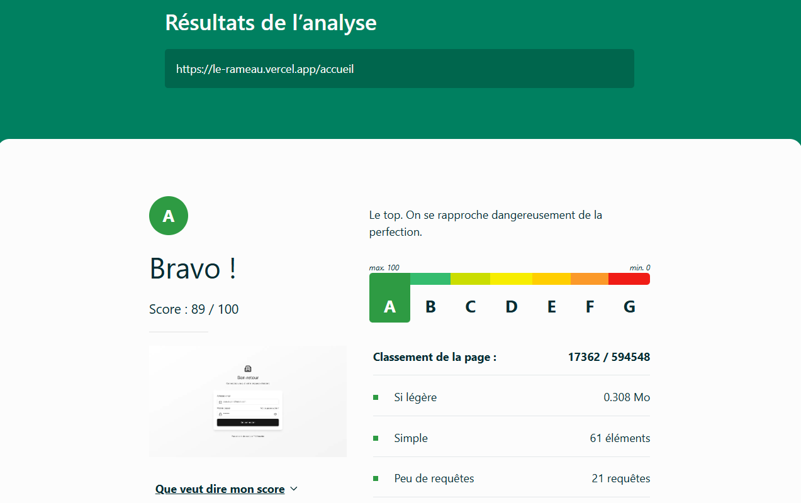
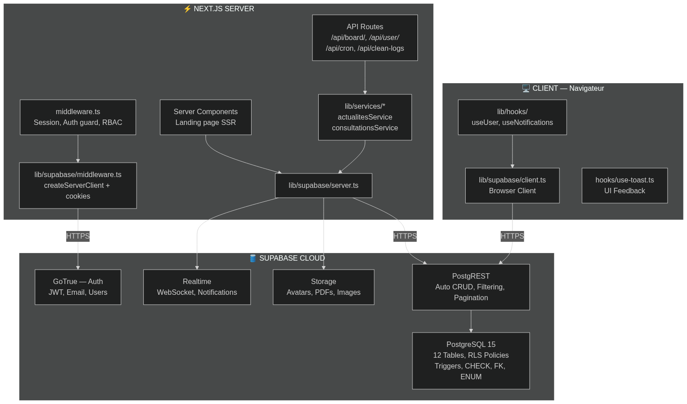
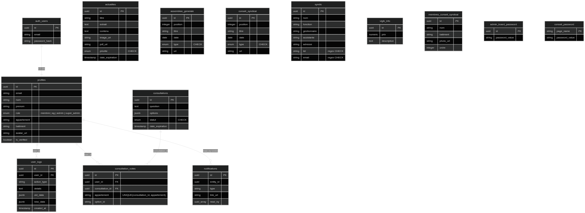
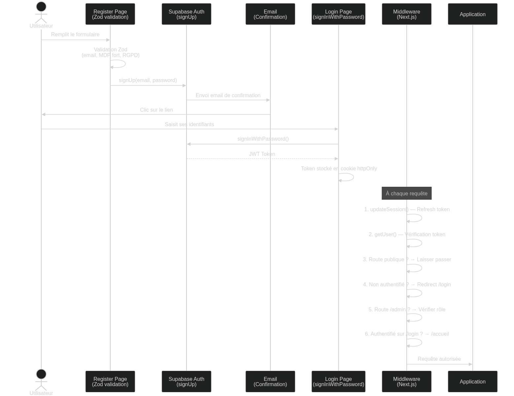
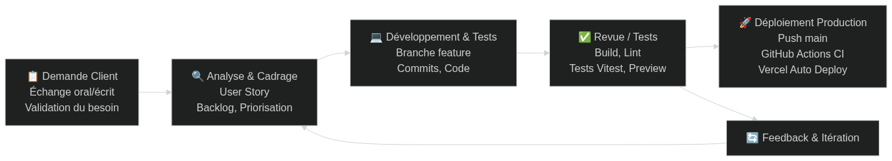
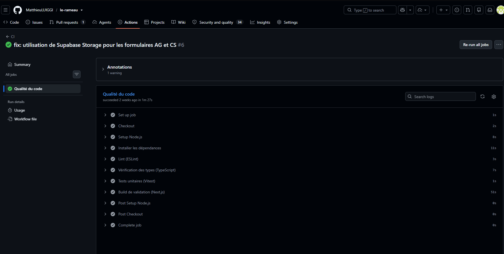
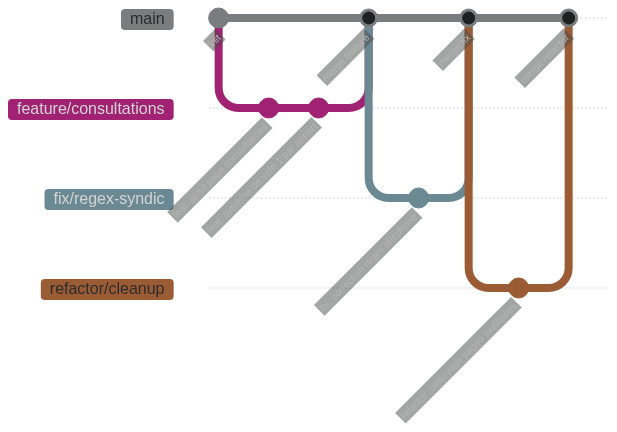
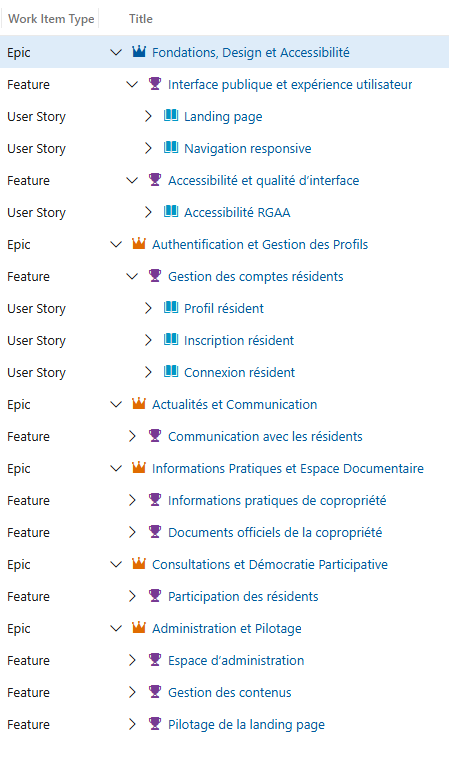

# Livret candidat – RNCP Concepteur Développeur Web Full Stack

Ce livret guide pas à pas la production des livrables et la préparation des soutenances pour chacun des blocs RNCP.

Ce document rassemble la version finale et détaillée de l'ensemble des 4 blocs.

---

# BLOC 1 – Concevoir un projet de développement digital sécurisé

> **Projet** : Le Rameau – Application de gestion de copropriété  
> **Candidat** : Matthieu LUIGGI  
> **Date** : 03/07/2026  

---

## 1. Note de veille

### 1.1. Objectifs du projet

Le projet **Le Rameau** vise à développer une plateforme web moderne et sécurisée de gestion de copropriété pour la résidence Le Rameau, située au 5 rue André Malraux à Dijon. Les objectifs principaux sont :

- **Centraliser la communication** entre copropriétaires, conseil syndical et syndic
- **Dématérialiser les documents officiels** : PV d'assemblées générales, comptes rendus du conseil syndical, règlement de copropriété
- **Permettre la consultation citoyenne** via des sondages internes (un vote par appartement)
- **Gérer les badges d'accès Vigik** (tarification, procédure de remplacement)
- **Moderniser l'image** de la copropriété avec une interface premium, supportant les modes clair et sombre
- **Offrir un espace d'administration** au conseil syndical pour la gestion du contenu

### 1.2. Sources de veille

| Catégorie | Sources consultées | Fréquence |
|---|---|---|
| **Technologique** | Next.js Blog & Release Notes, Supabase Changelog, Vercel Blog, MDN Web Docs, State of JS Survey | Hebdomadaire |
| **Juridique / Réglementaire** | CNIL (fiches RGPD), RGAA 4.1, Légifrance (loi copropriété du 10/07/1965), Loi Informatique & Libertés | Mensuelle |
| **Sécurité** | OWASP Top 10 (2025), Mozilla Observatory (https://developer.mozilla.org/en-US/observatory), CVE Database | Mensuelle |
| **Eco-conception** | GreenIT.fr, EcoIndex (GitHub Action `greenit-analysis`), RGESN (Référentiel Général d'Écoconception) | Trimestrielle |
| **Concurrentielle** | Solutions existantes (Chouette Copro, MyFoncia, Homeland, Cotoit Digital) | Ponctuelle |
| **Performance** | Speedlify (dashboard Lighthouse automatisé, https://github.com/coda-school/speedlify/), Core Web Vitals | Mensuelle |
| **CIGREF** | Rapports annuels CIGREF sur l'obsolescence numérique et la sobriété digitale | Annuelle |

### 1.3. Synthèse des évolutions observées

#### Évolutions technologiques
- **Next.js 14 App Router** : Adoption du nouveau paradigme de routage basé sur les fichiers (`app/` directory), avec Server Components par défaut, réduction de la taille du bundle client, streaming SSR.
- **Supabase v2** : Consolidation comme alternative open-source à Firebase avec authentification intégrée, Row Level Security (RLS), stockage, fonctions Edge et API REST auto-générée.
- **React 18** : Support natif du Concurrent Rendering, Suspense pour le data fetching, amélioration des performances de rendu.
- **TypeScript strict mode** : Le projet utilise le mode `strict: true` pour garantir la sûreté de type à la compilation.

#### Évolutions réglementaires
- **RGPD** : Obligation de consentement explicite pour la collecte de données personnelles. Le projet intègre une case RGPD obligatoire à l'inscription avec un lien vers la politique de confidentialité.
- **RGAA 4.1** : Accessibilité numérique rendue obligatoire pour les services en ligne. Le projet utilise du HTML sémantique, l'attribut `lang="fr"`, des labels sur les formulaires, et des contrastes conformes.
- **RSE / Éco-conception** : La loi REEN (Réduction de l'Empreinte Environnementale du Numérique) incite à l'éco-conception. Le projet limite les assets lourds, utilise le lazy loading, compresse les images côté client (`lib/compressImage.ts`), et stocke les fichiers dans Supabase Storage (CDN + cache HTTP) plutôt qu'en base64 dans la base de données. Le score EcoIndex obtenu est **A (89/100)**.

#### Recommandations CIGREF & Obsolescence
- Choix de technologies mainstream à forte communauté (Next.js, React, Supabase) pour limiter le risque d'obsolescence.
- Utilisation de versions LTS de Node.js (18+).
- Pas de vendor lock-in fort : Supabase est open-source et les données peuvent être exportées depuis PostgreSQL.

### 1.4. Impacts sur le projet

| Évolution | Impact sur Le Rameau |
|---|---|
| Next.js 14 App Router | Architecture en route groups `(app)`, `(auth)`, Server Components pour la landing page, Client Components pour l'interactivité |
| Supabase Auth | Authentification complète (inscription/connexion/déconnexion), JWT tokens via cookies, middleware de session |
| RGPD | Case de consentement à l'inscription, pages légales (CGU, confidentialité, mentions légales), données minimales collectées |
| RGAA | Attribut `lang="fr"`, formulaires avec labels, contrastes adaptatifs (dark/light), navigation au clavier |
| Eco-conception | Compression d'images (`compressImage.ts`), lazy loading Spline 3D, SSR pour réduire le JS client, stockage des fichiers via Supabase Storage (CDN + cache) au lieu de base64 en DB — **EcoIndex A (89/100)** |
| Sécurité OWASP | RLS Supabase, validation Zod côté client, sanitisation des données dans le logger, CORS et headers sécurisés via middleware |

---

## 2. Analyse des besoins et benchmark

### 2.1. Présentation du client

**Le commanditaire** : Le Conseil Syndical de la copropriété Le Rameau, Dijon.

**Contexte** : La résidence Le Rameau est un ensemble immobilier comprenant plusieurs bâtiments, situé au 5 rue André Malraux, quartier Clemenceau, Dijon. La gestion de la copropriété est assurée par un syndic professionnel, avec un conseil syndical élu en assemblée générale.

**Problématique** : La communication entre le conseil syndical, le syndic et les copropriétaires repose sur des supports papier, des e-mails et des outils disparates. Il n'existe aucune plateforme centralisée permettant aux résidents d'accéder aux documents, de consulter les actualités ou de participer aux décisions collectives.

**Cible** : Les copropriétaires et résidents de la résidence Le Rameau (toutes générations confondues, avec une attention portée à l'accessibilité).

### 2.2. Analyse de marché (PESTEL)

| Facteur | Analyse |
|---|---|
| **Politique** | Loi ALUR (2014) et loi ELAN (2018) imposent la dématérialisation progressive des documents de copropriété. Encouragement à la participation numérique. |
| **Économique** | Budget limité (projet interne au conseil syndical). Choix de stack gratuite/open-source (Supabase plan gratuit, Vercel plan hobby). Pas de coûts d'hébergement récurrents significatifs. |
| **Socioculturel** | Résidents de profils variés, certains peu familiers avec les outils numériques → nécessité d'une interface intuitive et accessible. |
| **Technologique** | Adoption croissante des applications web progressives. Next.js et Supabase offrent un time-to-market rapide avec un haut niveau de qualité. |
| **Écologique** | Obligation de sobriété numérique (loi REEN). Choix d'hébergement sur Vercel Edge (serveurs optimisés). Compression d'images. |
| **Légal** | RGPD (consentement, droit d'accès, portabilité), RGAA (accessibilité), loi du 10 juillet 1965 (copropriété). |

### 2.3. Analyse SWOT

| | **Positif** | **Négatif** |
|---|---|---|
| **Interne** | **Forces** : Stack moderne et performante, développement itératif, design premium (dark/light), gratuit pour la copropriété, pipeline CI/CD automatisé, 27 tests unitaires | **Faiblesses** : Développeur unique (bus factor = 1), couverture de tests à étendre, base utilisateur limitée à une résidence |
| **Externe** | **Opportunités** : Dématérialisation imposée par la loi, fort besoin identifié des résidents, modèle réplicable à d'autres copropriétés | **Menaces** : Solutions commerciales existantes (MyFoncia, Cotoit), adoption incertaine des résidents les plus âgés |

### 2.4. Benchmark

| Solution | Points forts | Points faibles | Différenciateur Le Rameau |
|---|---|---|---|
| **MyFoncia** | Marque connue, multi-résidences | Interface datée, payant, lourd | Interface moderne premium, gratuit |
| **Cotoit Digital** | Fonctionnalités complètes | Payant, complexe | Simple et intuitif |
| **Chouette Copro** | Open source | Peu maintenu | Activement développé, design soigné |
| **Le Rameau** | Design premium, dark mode, modèle 3D, consultations, notifications temps réel | Mono-résidence pour le moment | Sur-mesure pour les besoins exacts |

### 2.5. Synthèse des besoins fonctionnels et non fonctionnels

#### Besoins fonctionnels

| Besoin | Priorité |
|---|---|
| Authentification sécurisée (email + confirmation) | Haute |
| Gestion des actualités (CRUD + images/PDFs) | Haute |
| Consultations / sondages (vote unique par appartement) | Haute |
| Espace documentaire AG et Conseil Syndical | Haute |
| Dashboard admin centralisé | Haute |
| Notifications en temps réel | Moyenne |
| Dark mode et responsive design | Moyenne |
| Profil utilisateur (modification + suppression RGPD) | Haute |

#### Besoins non fonctionnels

| Catégorie | Exigence |
|---|---|
| **Performance** | Temps de chargement < 3s, Score Lighthouse > 80 |
| **Sécurité** | RLS, JWT httpOnly, validation Zod, CRON sécurisé |
| **Accessibilité** | RGAA 4.1 / WCAG 2.1 AA |
| **Éco-conception** | EcoIndex ≥ 80, pas de base64 en DB |
| **Maintenabilité** | TypeScript strict, couche service, CI/CD |

---

## 3. Cadrage technique

### 3.1. Choix technologiques argumentés (sous forme d'ADR)

#### ADR-001 : Choix du framework front-end — Next.js 14

**Contexte** : Besoin d'une application web performante, SEO-friendly, avec Server Side Rendering.

**Décision** : Adoption de **Next.js 14** avec App Router.

**Justification** :
- SSR et SSG natifs → amélioration du SEO et de la performance
- App Router avec route groups → organisation claire `(app)/`, `(auth)/`
- Server Components par défaut → réduction du JavaScript envoyé au client
- Middleware natif → gestion de l'authentification et des redirections
- Écosystème React mature (Radix UI, Framer Motion, SWR)
- Déploiement optimisé sur Vercel (Edge Functions, CDN global)

**Alternatives rejetées** : Vite + React (pas de SSR natif), Angular (complexité excessive pour le scope), Remix (écosystème moins mature).

#### ADR-002 : Choix du BaaS — Supabase

**Contexte** : Besoin d'un backend avec authentification, base de données, stockage et API REST.

**Décision** : Adoption de **Supabase** (PostgreSQL managé + Auth + Storage + Realtime).

**Justification** :
- Open-source (pas de vendor lock-in)
- PostgreSQL avec RLS (Row Level Security) pour la sécurité côté données
- Auth intégrée (email/password, tokens JWT)
- API REST auto-générée (PostgREST)
- Realtime pour les notifications
- Plan gratuit suffisant pour le cahier des charges

**Alternatives rejetées** : Firebase (vendor lock-in Google, NoSQL), backend Node.js custom (time-to-market trop long pour un seul développeur).

#### ADR-003 : Choix du styling — Tailwind CSS + shadcn/ui

**Contexte** : Besoin d'un design premium, responsive, avec dark mode et composants accessibles.

**Décision** : Adoption de **Tailwind CSS 3** + composants **shadcn/ui** (basés sur Radix UI).

**Justification** :
- Tailwind : utility-first, purge automatique du CSS inutilisé, dark mode natif via `.dark`
- shadcn/ui : composants accessibles par défaut (Radix UI), personnalisables, copiés dans le projet (pas de dépendance externe)
- Variables CSS HSL pour le theming (`globals.css`)
- Animations via `tailwindcss-animate` et `framer-motion`

#### ADR-004 : Validation des données — Zod

**Contexte** : Besoin de valider les entrées utilisateur côté client et de générer des types TypeScript.

**Décision** : Adoption de **Zod** pour la validation des formulaires.

**Justification** :
- Inférence de types TypeScript automatique (`z.infer<typeof schema>`)
- Intégration native avec React Hook Form via `@hookform/resolvers`
- Validation déclarative et composable
- Messages d'erreur en français personnalisables

**Exemple concret dans le projet** (fichier `lib/validations.ts`) :
- `loginSchema` : validation email + mot de passe (min 6 caractères)
- `registerSchema` : validation complète (prénom, nom, email, mot de passe fort avec regex, bâtiment, appartement, consentement RGPD)

### 3.2. Schéma d'architecture



### 3.3. Description des couches

| Couche | Technologie | Rôle |
|---|---|---|
| **Présentation (Front-end)** | Next.js 14, React 18, Tailwind CSS, shadcn/ui, Framer Motion | Interface utilisateur responsive, animations, dark mode |
| **Routage & Middleware** | Next.js Middleware (`middleware.ts`) | Protection des routes, rafraîchissement de session, RBAC admin |
| **Logique métier (Client)** | React Hook Form, Zod, SWR, custom hooks (`useUser`, `useNotifications`) | Validation, data fetching, gestion d'état |
| **API** | Next.js API Routes (`/api/board/member`, `/api/user/delete`, `/api/cron`, `/api/clean-logs`) | Endpoints pour opérations sensibles (suppression compte, nettoyage logs) |
| **Backend** | Supabase (PostgREST) | Auto-génération d'API REST à partir du schéma PostgreSQL |
| **Base de données** | PostgreSQL 15 (Supabase) | 12 tables avec RLS, contraintes CHECK, clés étrangères, types ENUM |
| **Authentification** | Supabase Auth | Inscription par email avec confirmation, JWT via cookies, session SSR |
| **Stockage** | Supabase Storage | 4 buckets : `actualites-images`, `actualites-fichiers`, `ag-fichiers`, `cs-fichiers` |
| **Hébergement** | Vercel (Edge Network) | CDN mondial, SSL automatique, déploiement continu via Git |

### 3.4. Sélection et intégration des outils IA/Data Science (C3)

Conformément au référentiel RNCP, cette section compare et justifie les outils d'intelligence artificielle et d'assistance au développement utilisés dans le cadre du projet Le Rameau.

#### Contexte d'utilisation

Le projet Le Rameau ne dispose pas de fonctionnalités d'IA intégrées dans l'application elle-même (pas d'algorithme de recommandation, de chatbot ou de traitement de données). En revanche, des **outils IA d'assistance au développement** ont été sélectionnés et utilisés tout au long du cycle de développement comme assistants de codage (*AI pair programming*).

#### Comparaison des outils IA étudiés

| Critère | GitHub Copilot | Claude / Gemini |
|---|---|---|
| **Type** | Complétion de code inline | Assistant conversationnel (LLM) |
| **Intégration IDE** | ✅ Native VS Code (extension officielle) | ⚠️ Extension tierce ou interface web (claude.ai, gemini.google.com) |
| **Qualité suggestions** | Haute (entraîné sur GitHub) | Très haute (contexte long, raisonnement étendu) |
| **Contexte de fichier** | Fichier courant + fichiers ouverts dans VS Code | ✅ Multi-fichiers via copier-coller (contexte jusqu'à 200K tokens) |
| **Confidentialité du code** | ⚠️ Code envoyé aux serveurs Microsoft/GitHub | ⚠️ Données envoyées à Anthropic / Google |
| **Gestion des données sensibles** | Exclusion possible via Copilot settings | Pas d'upload automatique (copier-coller sélectif) |
| **Coût** | ~10 €/mois (plan étudiant gratuit via GitHub Education) | Gratuit (claude.ai / Gemini.google.com) ou Pro payant |
| **Support TypeScript/Next.js** | ✅ Excellent | ✅ Excellent |
| **Propriété intellectuelle** | Code suggéré sous licence de l'utilisateur | Pas de revendication |

#### Outils retenus et justification

**GitHub Copilot (retenu – usage principal)** :
- Intégré nativement à VS Code (IDE utilisé sur le projet) via l'extension officielle
- Complétion en temps réel sans interruption du flux de développement
- Particulièrement efficace sur les patterns répétitifs : composants React, hooks TypeScript, schémas Zod
- Plan étudiant gratuit disponible via GitHub Education
- Utilisé principalement pour la **génération de code boilerplate** (composants UI, handlers d'événements, types TypeScript)

**Claude / Gemini (retenu – usage complémentaire)** :
- Capacité d'analyse sur un contexte long (plusieurs fichiers, architecture complète)
- Utilisé pour la **réflexion architecturale** (choix ADR, structure de la base de données), la **revue de code** et la **rédaction de documentation**
- Interface conversationnelle adaptée aux échanges itératifs sur des problèmes complexes
- Gemini Avancifié (Google) utilisé comme alternative pour les tâches nécessitant une recherche web intégrée

#### Mesures de sécurité et de confidentialité

Le projet manipule des données personnelles de copropriétaires (noms, appartements, emails). Les précautions suivantes ont été appliquées dans l'utilisation des outils IA :

| Risque | Mesure appliquée |
|---|---|
| **Envoi de données personnelles aux LLM** | Aucune donnée réelle de copropriétaires n'a été partagée avec les outils IA — seul du code structure/anonymisé |
| **Variables d'environnement et secrets** | Le fichier `.env.local` (clés Supabase) est exclu du contexte partagé |
| **Propriété intellectuelle** | Le code généré est relu, compris et adapté avant intégration — il ne constitue pas une copie aveugle |
| **Dépendance excessive à l'IA** | L'IA a été utilisée comme accélérateur, les décisions d'architecture restent manuelles et documentées dans les ADR |

#### Aspects éthiques

- **Transparence** : L'usage d'outils IA dans le développement est déclaré explicitement dans ce livret
- **Maîtrise du code** : Chaque suggestion IA a été comprise, testée et validée — le candidat est en mesure d'expliquer et de modifier tout le code produit
- **Propriété du code** : Les conditions d'utilisation de GitHub Copilot et Claude précisent que le code généré appartient à l'utilisateur
- **Biais et limites** : Les suggestions IA ont parfois nécessité des corrections (patterns dépréciés, erreurs de types TypeScript) — un sens critique a été maintenu en permanence

### 3.5. Prise en compte de la sécurité, de l'éthique et de l'accessibilité

#### Sécurité
- **Authentification** : Supabase Auth avec confirmation email, mots de passe hashés (bcrypt côté Supabase)
- **Autorisation** : RLS (Row Level Security) sur PostgreSQL, middleware Next.js pour la protection des routes, RBAC (rôles `membre`, `ag`, `admin`, `super_admin`)
- **Validation** : Zod côté client, contraintes CHECK en base de données (regex sur téléphones, emails)
- **Sanitisation** : Le logger tronque les données sensibles/lourdes (URLs, contenus volumineux)
- **Headers de sécurité** : Vérifiable via Mozilla Observatory
- **Pas de stockage de données sensibles côté client** : Tokens en cookies httpOnly via `@supabase/ssr`

#### Éthique
- **Données minimales** : Seules les données nécessaires sont collectées (nom, prénom, email, bâtiment, appartement)
- **Consentement RGPD** : Case obligatoire à l'inscription
- **Droit à l'oubli** : Endpoint API `/api/user/delete` pour la suppression de compte
- **Transparence** : Pages légales accessibles publiquement (CGU, confidentialité, mentions légales)

#### Accessibilité
- `<html lang="fr">` pour les lecteurs d'écran
- Composants Radix UI avec gestion native ARIA
- Navigation au clavier (focus, tabulation)
- Contrastes validés pour les modes clair et sombre

---

## 4. Cahier des charges

### 4.1. Besoins fonctionnels

Voir la section 2.5 ci-dessus pour le tableau complet des 15 besoins fonctionnels identifiés, priorisés et implémentés.

### 4.2. Contraintes techniques

| Contrainte | Solution retenue |
|---|---|
| Responsive (mobile-first) | Tailwind CSS breakpoints (`sm`, `md`, `lg`), layout sidebar + mobile tab bar |
| Performance | SSR Next.js, compression images, lazy loading Spline 3D |
| Navigateurs cibles | Chrome, Firefox, Safari, Edge (dernières 2 versions) |
| Sécurité | RLS, JWT, Middleware, Zod, CORS |
| Hébergement | Vercel (Edge Network, SSL, CI/CD) |
| Base de données | PostgreSQL 15 via Supabase |

### 4.3. Documentation API

#### API REST Supabase (auto-générée via PostgREST)

Toutes les opérations CRUD sur les 12 tables sont disponibles via le SDK Supabase. Les politiques RLS restreignent l'accès en fonction du rôle de l'utilisateur authentifié.

#### API Routes Next.js (custom)

| Route | Méthode | Description | Authentification |
|---|---|---|---|
| `/api/user/delete` | DELETE | Suppression de compte (droit RGPD à l'effacement) | JWT requis |
| `/api/board/member` | DELETE | Retrait d'un membre du conseil syndical | JWT + rôle admin |
| `/api/cron/check-expirations` | GET | Tâche planifiée : suppression des actualités expirées | `CRON_SECRET` (header Bearer) |
| `/api/clean-logs` | POST | Purge des logs anciens | JWT requis |

### 4.4. Règles de déploiement

1. **Environnement de développement** : `npm run dev` (serveur local Next.js)
2. **Build de production** : `npm run build` (compilation TypeScript + optimisation)
3. **Pipeline CI** : Push sur `main` → GitHub Actions (lint + typecheck + tests Vitest + build)
4. **Déploiement** : Push sur la branche `main` → déploiement automatique via Vercel
5. **Variables d'environnement** : Configurées dans Vercel Dashboard (`.env.local` en local) + Secrets GitHub Actions pour le CI
6. **Base de données** : Migrations SQL via l'éditeur Supabase ou fichier `supabase/schema.sql`
7. **Storage** : Buckets configurés via `supabase/storage-buckets.sql` et `supabase/storage-ag-cs.sql`

### 4.5. Exigences RGAA

| Critère RGAA | Implémentation dans Le Rameau |
|---|---|
| 1.1 Image informative | Images avec attributs `alt` descriptifs |
| 3.1 Couleurs et contrastes | Variables CSS HSL avec ratios AA validés (dark/light) |
| 8.1 Langue | `<html lang="fr">` |
| 8.6 Titre de page | Métadonnée `<title>` définie via `export const metadata` |
| 11.1 Labels de formulaire | Composant `<Label>` associé à chaque `<Input>` via `<FormField>` |
| 11.10 Contrôle de saisie | Validation Zod avec messages d'erreur en français, `<FormMessage>` |
| 12.1 Navigation | Sidebar, Mobile Tab Bar, liens skip-to-content via structure HTML sémantique |

---

## 1. Analyse des usages et contraintes

### 1.1. Contraintes techniques et graphiques

| Catégorie | Contrainte | Solution mise en œuvre |
|---|---|---|
| **Navigateurs** | Chrome, Firefox, Safari, Edge (dernières 2 versions) | Tailwind CSS avec autoprefixer, composants Radix UI compatibles |
| **Terminaux** | Mobile (360px), Tablette (768px), Desktop (1024px+) | Tailwind breakpoints `sm`, `md`, `lg`, layout responsive (sidebar desktop + tab bar mobile) |
| **Performance** | Temps de chargement < 3s | SSR Next.js, lazy loading Spline 3D (`strategy="lazyOnload"`), compression images |
| **Accessibilité** | RGAA AA | HTML sémantique, labels, contrastes, navigation clavier |
| **Design** | Dark mode + light mode | ThemeProvider (next-themes), variables CSS HSL |
| **Police** | Lisibilité tous publics | Inter (Google Fonts), 16px minimum, variable `--font-sans` |
| **Animations** | Fluidité sans surcharge | Framer Motion avec `layoutId` pour la sidebar, transitions CSS pour les hover |
| **Sécurité front** | Pas de données sensibles exposées | Variables d'env `NEXT_PUBLIC_*` uniquement, tokens en cookies |

### 1.2. Justification des choix technologiques front-end

| Technologie | Justification |
|---|---|
| **React 18** | Librairie UI la plus adoptée, écosystème riche, Concurrent Rendering, Suspense |
| **Next.js 14 (App Router)** | SSR/SSG natif, route groups, middleware, Server Components par défaut |
| **TypeScript (strict)** | Détection d'erreurs à la compilation, autocomplétion, refactoring sûr |
| **Tailwind CSS 3** | Utility-first CSS, purge automatique, dark mode via `.dark` class |
| **shadcn/ui** | Composants accessibles (Radix UI), personnalisables, copiés dans le projet |
| **Framer Motion** | Animations déclaratives React, `layoutId` pour transitions partagées |
| **SWR** | Data fetching avec cache, revalidation automatique, mutations optimistes |
| **React Hook Form + Zod** | Formulaires performants (uncontrolled), validation type-safe |
| **Lucide React** | Bibliothèque d'icônes SVG légère, cohérente, tree-shakeable |
| **Spline** | Modèle 3D interactif sur la landing page (robot avec bulle de dialogue) |
| **date-fns** | Formatage de dates léger, localisé en français (`fr` locale) |
| **next-themes** | Gestion dark/light mode avec persistance et sans flash |

---

## 2. Maquettes techniques et intégration

### 2.1. Architecture des pages et composants

#### Structure des routes (App Router)

```
app/
├── page.tsx                    → Landing Page publique (SSR)
├── layout.tsx                  → Root Layout (police Inter, ThemeProvider, Toaster)
├── globals.css                 → Variables CSS (thème clair/sombre)
│
├── (auth)/                     → Route group : pages d'authentification
│   ├── login/page.tsx          → Page de connexion
│   └── register/page.tsx       → Page d'inscription
│
├── (app)/                      → Route group : espace authentifié
│   ├── layout.tsx              → Layout avec Sidebar + Header + MobileTabBar
│   ├── accueil/page.tsx        → Dashboard d'accueil personnalisé
│   ├── actualites/page.tsx     → Liste des actualités
│   │   └── [id]/page.tsx       → Détail d'une actualité
│   ├── badges-vigik/page.tsx   → Informations badges Vigik
│   ├── syndic/page.tsx         → Fiche du syndic
│   ├── ag/page.tsx             → Assemblées Générales
│   ├── conseil-syndical/page.tsx → Conseil Syndical
│   ├── consultations/page.tsx  → Sondages / votes
│   ├── contactez-nous/page.tsx → Formulaire de contact
│   ├── profil/page.tsx         → Gestion du profil utilisateur
│   └── dashboard/              → Espace administration
│       ├── page.tsx            → Tableau de bord admin
│       ├── actualites/         → CRUD actualités
│       ├── ag/                 → CRUD assemblées
│       ├── badges-vigik/       → Config badges
│       ├── conseil-syndical/   → CRUD conseil
│       ├── consultations/      → CRUD sondages
│       ├── syndic/             → Config syndic
│       └── message-robot/      → Config message robot 3D
│
├── admin/board/                → Panneau d'affichage admin (protégé par mot de passe)
│
├── api/                        → API Routes Next.js
│   ├── board/member/           → Gestion des membres
│   ├── user/delete/            → Suppression de compte
│   ├── cron/                   → Tâches planifiées
│   └── clean-logs/             → Nettoyage des logs
│
├── conditions-generales/       → Page CGU
├── confidentialite/            → Politique de confidentialité
└── mentions-legales/           → Mentions légales
```

#### Arborescence des composants

```
components/
├── ui/                         → Composants primitifs (shadcn/ui)
│   ├── avatar.tsx              → Avatar avec fallback initiales
│   ├── badge.tsx               → Badge coloré
│   ├── button.tsx              → Bouton avec variantes (CVA)
│   ├── card.tsx                → Carte (Header, Content, Title, Description)
│   ├── checkbox.tsx            → Case à cocher Radix
│   ├── dialog.tsx              → Modale Radix
│   ├── dropdown-menu.tsx       → Menu déroulant Radix
│   ├── form.tsx                → Composants de formulaire (React Hook Form)
│   ├── input.tsx               → Champ de saisie
│   ├── label.tsx               → Label de formulaire
│   ├── scroll-area.tsx         → Zone de scroll Radix
│   ├── select.tsx              → Select Radix
│   ├── skeleton.tsx            → Placeholder de chargement
│   ├── tabs.tsx                → Onglets Radix
│   ├── textarea.tsx            → Zone de texte
│   ├── toast.tsx               → Notification toast Radix
│   └── toaster.tsx             → Conteneur de toasts
│
├── landing/                    → Composants de la landing page
│   ├── Hero.tsx                → Section héroïque avec robot 3D Spline
│   ├── FeaturesSection.tsx     → Grille des fonctionnalités
│   └── Footer.tsx              → Pied de page avec liens légaux
│
├── layout/                     → Composants de mise en page
│   ├── Sidebar.tsx             → Navigation latérale desktop (animée)
│   ├── Header.tsx              → En-tête mobile
│   ├── MobileTabBar.tsx        → Barre de navigation mobile fixe
│   └── NotificationBell.tsx    → Cloche de notifications
│
├── board/
│   └── BoardLayout.tsx         → Layout du panneau d'affichage admin
│
└── dashboard/
    └── QuickActions.tsx        → Actions rapides admin
```

### 2.2. Pages intégrées

| Page | Composants clés | Fonctionnalités |
|---|---|---|
| **Landing** | Hero (Spline 3D), FeaturesSection, Footer | SSR, animations Framer Motion, robot interactif |
| **Login / Register** | FormField, Zod validation | Auth Supabase, politique MDP forte, consentement RGPD |
| **Accueil** | QuickActions, NotificationBell | Dashboard personnalisé, accès rapides contextuels |
| **Actualités** | Card, Badge (priorité), ReactQuill | Liste paginée, détail avec contenu riche |
| **Consultations** | Tabs, Progress, RadioGroup | Vote unique par appartement, résultats en temps réel |
| **Dashboard admin** | CRUD complet, drag & drop (dnd-kit) | Gestion actualités, AG, CS, consultations, syndic |
| **Profil** | AvatarUpload, cropImage | Modification données, suppression compte (RGPD) |

### 2.3. Règles d'accessibilité appliquées

| Règle | Implémentation | Fichier(s) concerné(s) |
|---|---|---|
| **RGAA 8.1** — Langue par défaut | `<html lang="fr">` | `app/layout.tsx` |
| **RGAA 8.1** — Suppression hydratation flash | `suppressHydrationWarning` | `app/layout.tsx` |
| **RGAA 8.6** — Titre de page | `export const metadata: Metadata` avec `title` et `description` | `app/layout.tsx` |
| **RGAA 11.1** — Labels de formulaire | `<Label>` associé à chaque `<FormField>` via `<FormItem>` | Login, Register, tous les formulaires |
| **RGAA 11.10** — Messages d'erreur | `<FormMessage>` en français sous chaque champ | Tous les formulaires (Zod) |
| **RGAA 3.1** — Contrastes | Variables CSS HSL distinctes clair/sombre, muted-foreground à 30% | `globals.css` |
| **RGAA 12.1** — Navigation | Sidebar avec icônes + labels, mobile tab bar | Sidebar.tsx, MobileTabBar.tsx |
| **WCAG 2.1 AA** — Focus visible | Focus ring natif sur les composants Radix UI | button.tsx, input.tsx, etc. |
| **ARIA** — Icônes décoratives | `aria-hidden="true"` sur les icônes de navigation | Sidebar.tsx |
| **Sémantique HTML** | `<header>`, `<main>`, `<footer>`, `<nav>`, `<section>` | Landing page, Layout |

---

## 3. Qualité du code

### 3.1. Application des normes et standards

#### TypeScript strict mode

Le projet utilise TypeScript en mode strict (`tsconfig.json` : `"strict": true`), garantissant :
- Vérification des types `null` et `undefined`
- **Élimination totale du type `any`** : tous les `any` explicites ont été refactorisés lors d'un refactoring de qualité. Par exemple, `lib/logger.ts` utilise désormais `Record<string, unknown>` au lieu de `any` pour les paramètres `old_data` / `new_data`, et `lib/validations.ts` a été nettoyé de ses assertions `as any`.
- Vérification des paramètres de fonction

#### Typage fort avec interfaces personnalisées

```typescript
// types/index.ts
export type UserRole = 'resident' | 'conseil' | 'admin' | 'super_admin' | 'membre' | 'ag'

export interface User {
    id: string
    email: string
    nom: string
    prenom: string
    role: UserRole
    appartement?: string
    batiment?: string
    telephone?: string
    avatar_url?: string
    is_verified: boolean
    created_at: string
}
```

#### Validation avec Zod — Extrait commenté

```typescript
// lib/validations.ts — Schéma d'inscription
export const registerSchema = z.object({
    prenom: z.string().min(2, { message: "Prénom trop court" }),
    nom: z.string().min(2, { message: "Nom trop court" }),
    email: z.string().email({ message: "Email invalide" }),
    password: z.string()
        // Politique de mot de passe forte
        .min(8, { message: "Le mot de passe doit contenir au moins 8 caractères" })
        .regex(/[A-Z]/, { message: "...au moins une majuscule" })
        .regex(/[a-z]/, { message: "...au moins une minuscule" })
        .regex(/[0-9]/, { message: "...au moins un chiffre" })
        .regex(/[^A-Za-z0-9]/, { message: "...au moins un caractère spécial" }),
    confirmPassword: z.string().min(1, { message: "Veuillez confirmer votre mot de passe" }),
    batiment: z.string().min(1, { message: "Le bâtiment est obligatoire" }),
    appartement: z.string().min(1, { message: "Le numéro d'appartement est obligatoire" }),
    // Consentement RGPD obligatoire
    rgpd: z.literal(true, {
        errorMap: () => ({ message: "Veuillez accepter les conditions d'utilisations" })
    }),
}).refine((data) => data.password === data.confirmPassword, {
    message: "Les mots de passe ne correspondent pas",
    path: ["confirmPassword"],  // Erreur attachée au champ confirmPassword
});
```

### 3.2. Principes SOLID appliqués

| Principe | Application dans Le Rameau |
|---|---|
| **S** — Single Responsibility | Chaque composant a une seule responsabilité : `Sidebar.tsx` gère la navigation, `NotificationBell.tsx` gère les notifications, `Hero.tsx` gère la section héroïque |
| **O** — Open/Closed | Les composants `shadcn/ui` sont extensibles via le pattern `className` et `variants` (CVA) sans modifier le composant source |
| **L** — Liskov Substitution | Le `Button` accepte un `asChild` prop pour être remplacé par un `<Link>` Next.js tout en conservant le même contrat |
| **I** — Interface Segregation | Les hooks sont spécialisés : `useUser()` pour l'utilisateur, `useNotifications()` pour les notifications, `useToast()` pour les toasts |
| **D** — Dependency Inversion | Les composants dépendent d'abstractions (`createClient()`) et non de l'implémentation Supabase directe. Le mode démo (`DEMO_MODE`) en est la preuve : les mêmes composants fonctionnent sans Supabase |

### 3.3. Éco-conception

**Score EcoIndex obtenu : A (89/100)** — Classement 17 362 / 594 548 pages analysées.

| Métrique EcoIndex | Valeur | Médiane web | Appréciation |
|---|---|---|---|
| **Poids de page** | 0.308 Mo | 2.41 Mo | 🟢 Si légère |
| **Complexité DOM** | 61 éléments | 693 | 🟢 Simple |
| **Requêtes serveur** | 21 requêtes | 78 | 🟢 Peu de requêtes |



| Pratique | Implémentation |
|---|---|
| **Supabase Storage (CDN)** | Images/PDFs stockés dans 4 buckets Supabase Storage au lieu de base64 en DB — cache HTTP, CDN mondial |
| **Compression d'images** | `lib/compressImage.ts` — compression côté client avant upload (1200×1200, qualité 85%) |
| **Lazy loading** | Module Spline 3D chargé avec `strategy="lazyOnload"` |
| **Tree shaking** | Import nommé de Lucide React (`import { Home } from "lucide-react"`) |
| **CSS optimisé** | Tailwind purge automatique des classes inutilisées en production |
| **Pas de requêtes inutiles** | SWR avec cache et revalidation conditionnelle |
| **Pagination** | `.range(0, 49)` sur les listes (actualités, consultations) via couche service |
| **SSR** | Server Components par défaut, réduction du JS client |
| **Pas de polyfills inutiles** | Ciblage navigateurs récents uniquement |

### 3.4. Sécurité et compatibilité multi-navigateurs

#### Sécurité front-end

- **Pas de `dangerouslySetInnerHTML`** sauf pour le composant Spline (conteneur isolé)
- **Tokens en cookies httpOnly** via `@supabase/ssr` (pas de localStorage)
- **Variables d'environnement** : seules `NEXT_PUBLIC_*` sont exposées au client
- **Validation côté client** (Zod) ET côté serveur (contraintes PostgreSQL)
- **Protection CSRF** : cookies `SameSite`, gestion via middleware
- **Indicateur de force de mot de passe** visible à l'inscription

#### Compatibilité multi-navigateurs

- **PostCSS + Autoprefixer** : Configuration dans `postcss.config.mjs`
- **Police Inter via Google Fonts** : Rendu cohérent sur tous les navigateurs
- **Tailwind CSS** : Génération de CSS cross-browser compatible
- **Radix UI** : Composants testés sur Chrome, Firefox, Safari, Edge

---

## 4. Documentation de la chaîne front-end

### 4.1. Organisation du code

```
le-rameau/
├── app/                    → Routes et pages (App Router)
├── components/             → Composants React réutilisables
│   ├── ui/                 → Primitives (shadcn/ui — Radix)
│   ├── landing/            → Composants de la landing page
│   ├── layout/             → Navigation et mise en page
│   ├── board/              → Panneau d'affichage
│   └── dashboard/          → Composants admin
├── lib/                    → Logique métier
│   ├── supabase/           → Clients Supabase (client, server, middleware)
│   ├── hooks/              → Custom hooks (useUser, useNotifications)
│   ├── validations.ts      → Schémas Zod
│   ├── logger.ts           → Journalisation
│   ├── utils.ts            → Fonctions utilitaires (cn, getInitials)
│   ├── compressImage.ts    → Compression d'images
│   ├── cropImage.ts        → Recadrage d'images
│   └── demo-data.ts        → Données de démonstration
├── types/                  → Types TypeScript
├── hooks/                  → Hook global (use-toast)
├── public/                 → Assets statiques (PDFs, images)
├── supabase/               → Schéma SQL
└── scripts/                → Scripts utilitaires
```

### 4.2. Outils de versioning et de build

| Outil | Usage |
|---|---|
| **Git** | Versioning du code source, hébergé sur GitHub (`MatthieuLUIGGI/le-rameau`) |
| **npm** | Gestionnaire de paquets, scripts `dev`, `build`, `start`, `lint` |
| **Next.js Compiler (SWC)** | Compilation TypeScript → JavaScript, minification, tree shaking |
| **PostCSS** | Traitement CSS (autoprefixer, Tailwind) |
| **ESLint** | Linting avec `next/core-web-vitals` et `next/typescript` |
| **Vitest** | Tests unitaires (27 tests), couverture de code |
| **GitHub Actions** | CI/CD automatisé : lint + typecheck + tests + build sur chaque push |
| **Vercel** | Déploiement automatique sur push, preview deployments sur PR |

### 4.3. Procédures de contrôle qualité

| Procédure | Outil | Description | Automatisé en CI |
|---|---|---|---|
| **Linting** | ESLint (`next lint`) | Vérification des bonnes pratiques React/Next.js | ✅ GitHub Actions |
| **Type checking** | TypeScript (`strict: true`) | Détection d'erreurs de type à la compilation | ✅ GitHub Actions |
| **Tests unitaires** | Vitest (27 tests) | Validation des fonctions utilitaires, schémas Zod, sanitisation | ✅ GitHub Actions |
| **Build check** | `npm run build` | Vérification que le projet compile sans erreur | ✅ GitHub Actions |
| **Performance** | Lighthouse | Scores Performance (98), Accessibility (84), Best Practices (100), SEO (91) | Manuel |
| **Sécurité** | Mozilla Observatory | Analyse des headers HTTP de sécurité | Manuel |
| **Eco-conception** | EcoIndex | Score A (89/100) — poids 0.308 Mo, 61 éléments DOM, 21 requêtes | Manuel |
| **Validation HTML** | W3C Validator | Validation du HTML généré | Manuel |
| **Accessibilité** | axe DevTools / Lighthouse | Audit WCAG 2.1 AA | Manuel |

### 4.4. Design System — Variables CSS

Le design system est défini dans `app/globals.css` via des variables CSS HSL :

```css
/* Mode clair */
:root {
    --background: 0 0% 100%;          /* Fond blanc */
    --foreground: 0 0% 3.9%;          /* Texte quasi-noir */
    --primary: 0 0% 9%;               /* Couleur principale */
    --primary-foreground: 0 0% 98%;   /* Texte sur fond primaire */
    --muted-foreground: 0 0% 30%;     /* Texte secondaire (accessible) */
    --border: 0 0% 89.8%;             /* Bordures */
    --surface: 0 0% 100%;             /* Surface des cartes */
    --radius: 0.5rem;                 /* Rayon de bordure */
}

/* Mode sombre */
.dark {
    --background: 0 0% 3.9%;          /* Fond quasi-noir */
    --foreground: 0 0% 98%;           /* Texte blanc */
    --primary: 0 0% 98%;              /* Couleur principale inversée */
    --surface: 0 0% 7%;               /* Surface des cartes */
}
```

Le theming est géré par `next-themes` (`ThemeProvider`) avec persistance automatique dans `localStorage` et détection du système (`enableSystem`).

---

## 1. Environnement et architecture

### 1.1. Choix justifié des technologies

#### ADR-005 : Choix du backend — Supabase (BaaS)

**Contexte** : Le projet est développé par un développeur solo avec un budget limité. Le backend doit fournir : base de données relationnelle, authentification, stockage, API REST et fonctionnalités temps réel.

**Décision** : Utiliser **Supabase** comme Backend-as-a-Service.

**Justification** :
- **PostgreSQL managé** : Base de données relationnelle robuste avec support des contraintes, triggers, fonctions, types personnalisés
- **Row Level Security (RLS)** : Sécurité au niveau des lignes, chaque requête est filtrée par les politiques RLS
- **PostgREST** : Génération automatique d'une API REST à partir du schéma SQL (pas de code backend à écrire)
- **Auth intégrée** : Inscription, connexion, confirmation email, JWT tokens, gestion de session
- **Storage** : Stockage de fichiers (avatars, PDFs, images) avec buckets sécurisés
- **Realtime** : WebSocket pour les notifications en temps réel
- **Open-source** : Pas de vendor lock-in, données exportables depuis PostgreSQL
- **Plans** : Plan gratuit suffisant (500 MB base, 1 GB stockage, 50 000 auth/mois)

**Alternatives rejetées** :
- Firebase : NoSQL (inadapté pour un schéma relationnel complexe), vendor lock-in Google
- Backend Node.js/Express custom : Trop de code à maintenir seul, time-to-market trop long
- Prisma + PostgreSQL self-hosted : Pas de realtime natif, infrastructure à gérer

#### ADR-006 : Choix du cloud — Vercel + Supabase Cloud

**Décision** : Hébergement frontend sur **Vercel**, backend sur **Supabase Cloud**.

**Justification** :
- Vercel : CI/CD automatique, CDN Edge mondial, SSL automatique, optimisé pour Next.js
- Supabase Cloud : PostgreSQL managé, backups automatiques, haute disponibilité
- Coût : 0 € (plans gratuits des deux services suffisants pour le projet)

#### Technologies back-end complètes

| Technologie | Version | Rôle |
|---|---|---|
| **PostgreSQL** | 15 | Base de données relationnelle |
| **Supabase** | v2 | BaaS (Auth, Storage, Realtime, PostgREST) |
| **Next.js API Routes** | 14 | Endpoints custom (opérations sensibles) |
| **@supabase/ssr** | 0.8.0 | Gestion des cookies et sessions SSR |
| **@supabase/supabase-js** | 2.97.0 | Client JavaScript Supabase |
| **Zod** | 4.3.6 | Validation des données côté serveur |

### 1.2. Architecture logicielle back-end



### 1.3. Description des couches serveur

| Couche | Fichier(s) | Rôle |
|---|---|---|
| **Middleware** | `middleware.ts` | Interception de chaque requête : rafraîchissement session, vérification authentification, RBAC admin |
| **Session Management** | `lib/supabase/middleware.ts` | Création du client Supabase SSR, gestion des cookies de session |
| **API Routes** | `app/api/*/route.ts` | Endpoints custom pour opérations nécessitant un traitement serveur |
| **Service Layer** | `lib/services/actualitesService.ts`, `consultationsService.ts` | Couche d'abstraction métier découplant l'accès direct au client Supabase — facilite la testabilité, la maintenance et la migration progressive |
| **Server Client** | `lib/supabase/server.ts` | Client Supabase côté serveur (pour Server Components) |
| **Browser Client** | `lib/supabase/client.ts` | Client Supabase côté navigateur (pour Client Components) |
| **Logger** | `lib/logger.ts` | Journalisation des actions utilisateur dans `user_logs` |

---

## 2. Base de données

### 2.1. Schéma de la base de données

La base de données PostgreSQL comprend **12 tables** interconnectées :

#### Modèle Conceptuel de Données (MCD)



### 2.2. Détail des tables — Relations et types de champs

| Table | Champs clés | Type PK | Relations | Contraintes notables |
|---|---|---|---|---|
| **profiles** | id, email, nom, prenom, role, appartement, batiment, avatar_url, is_verified | UUID (FK → auth.users) | 1:1 avec auth.users | `UNIQUE(email)`, `role` de type ENUM `user_role` |
| **actualites** | titre, extrait, contenu, image_url, pdf_url, priorite, date_expiration | UUID auto | Aucune | `CHECK (priorite IN ('basse','normale','haute'))` |
| **consultations** | question, options (JSONB), statut | UUID auto | 1:N → consultation_votes | `CHECK (statut IN ('actif','termine'))` |
| **consultation_votes** | consultation_id, user_id, appartement, option_id | UUID auto | FK → consultations, FK → auth.users | Contrainte unique `(consultation_id, appartement)` |
| **assemblee_generale** | position, titre, date, type, url | UUID auto | Aucune | `CHECK (type IN ('file','link','empty'))` |
| **conseil_syndical** | position, titre, date, type, url | UUID auto | Aucune | `CHECK (type IN ('file','link','empty'))` |
| **syndic** | nom, fonction, gestionnaire, assistante, adresse, tel, email | UUID auto | Aucune | `CHECK regex` sur téléphone et email |
| **vigik_info** | prix, description | UUID auto | Aucune | `DEFAULT 16.00` |
| **notifications** | title, message, link_url, type, read_by[], entity_id | UUID auto | Aucune | `read_by` est un `uuid[]` (array PostgreSQL) |
| **user_logs** | user_id, user_name, user_email, action_type, details, old_data, new_data | UUID auto | Aucune (log brut) | `old_data` et `new_data` en `JSONB` |
| **membres_conseil_syndical** | nom, batiment, photo_url, ordre | UUID auto | Aucune | `ordre DEFAULT 0` |
| **admin_board_password** | password_value | UUID auto | Aucune | Protection du panneau admin |
| **conseil_password** | page_name (PK), password_value | TEXT (page_name) | Aucune | Protection des accès restreints |

### 2.3. Justification des choix de base de données

| Choix | Justification |
|---|---|
| **PostgreSQL** | Base relationnelle robuste, support des contraintes, types avancés (JSONB, arrays), RLS natif |
| **UUID comme clés primaires** | Sécurité (pas de IDs séquentiels prévisibles), compatibilité avec Supabase Auth |
| **JSONB pour les options** | Flexibilité pour les options de consultation (nombre variable), requêtes JSON en SQL |
| **Type ENUM `user_role`** | Contrôle strict des rôles autorisés au niveau base de données |
| **Contraintes CHECK** | Validation au niveau le plus bas (priorité, statut, format téléphone/email) |
| **Timestamps `timezone('utc')`** | Cohérence temporelle en UTC, formatage côté client avec `date-fns` |
| **Arrays PostgreSQL** | `read_by uuid[]` pour les notifications lues, efficient pour des listes courtes |
| **DEFAULT values** | Prix badge à 16€, descriptions par défaut → UX admin simplifiée |

---

## 3. Sécurité et conformité

### 3.1. Authentification et autorisation

#### Flux d'authentification



#### Rôles et permissions (RBAC)

| Rôle | Accès publiques | Espace résident | Dashboard admin | Panneau admin |
|---|---|---|---|---|
| **Visiteur (non connecté)** | ✅ Landing, légales | ❌ | ❌ | ❌ |
| **Membre** | ✅ | ✅ | ❌ | ❌ |
| **AG (Conseil)** | ✅ | ✅ | ✅ | ❌ |
| **Admin** | ✅ | ✅ | ✅ | ✅ |
| **Super Admin** | ✅ | ✅ | ✅ | ✅ |

#### Implémentation du middleware (extrait commenté)

```typescript
// middleware.ts
export async function middleware(request: NextRequest) {
    // 1. Mise à jour de la session (rafraîchissement token JWT)
    const response = await updateSession(request);
    
    // 2. Récupération de l'utilisateur courant
    const { data: { user } } = await supabase.auth.getUser();
    
    // 3. Routes publiques (pas d'auth requise)
    const isPublic = path === '/' || path === '/login' || path === '/register' 
        || path.startsWith('/api/') || path === '/conditions-generales' 
        || path === '/confidentialite' || path === '/mentions-legales';
    
    // 4. Redirection si non auth sur route protégée
    if (!user && !isPublic) {
        return NextResponse.redirect(new URL('/login', request.url));
    }
    
    // 5. Redirection si déjà auth sur page de login
    if (user && (path === '/login' || path === '/register')) {
        return NextResponse.redirect(new URL('/accueil', request.url));
    }
    
    // 6. Vérification RBAC pour les routes /admin
    if (path.startsWith('/admin') && user) {
        const { data: profile } = await supabase
            .from('profiles').select('role').eq('id', user.id).single();
        if (profile?.role !== 'admin' && profile?.role !== 'super_admin') {
            return NextResponse.redirect(new URL('/accueil', request.url));
        }
    }
}
```

### 3.2. Protection des données

| Mesure | Implémentation |
|---|---|
| **Mots de passe hashés** | bcrypt côté Supabase Auth (algorithme et salt gérés automatiquement) |
| **Tokens en cookies** | `@supabase/ssr` gère les tokens JWT en cookies (pas de localStorage) |
| **Cookie options** | `SameSite`, `Secure`, `Path` configurés via `setAll()` |
| **Pas de données sensibles côté client** | Seules les clés publiques (`NEXT_PUBLIC_*`) sont exposées |
| **Sanitisation du logger** | `sanitizeData()` tronque les champs lourds (image_url, contenu > 500 chars) |
| **Row Level Security** | Chaque table a des politiques RLS empêchant l'accès non autorisé |
| **Contraintes CHECK** | Validation au niveau base de données (regex téléphone, email, enums) |
| **Validation côté client** | Zod avec politique de mot de passe forte (8 chars, majuscule, minuscule, chiffre, spécial) |
| **Sécurisation du endpoint CRON** | Le endpoint `/api/cron/check-expirations` vérifie un header `Authorization: Bearer <CRON_SECRET>` — sans ce secret, toute requête reçoit un `401 Unauthorized`. La variable `CRON_SECRET` est définie dans les variables d'environnement Vercel. |
| **Middleware restrictif (liste blanche)** | Le middleware Next.js utilise une **liste explicite** de routes publiques au lieu de `path.startsWith('/api/')`. Toute nouvelle route API est protégée par défaut, empêchant l'exposition accidentelle d'endpoints non authentifiés. |

#### Conformité ANSSI (C15)

Les mesures de sécurité implémentées dans Le Rameau s'alignent sur les recommandations publiées par l'**Agence Nationale de la Sécurité des Systèmes d'Information (ANSSI)** :

| Recommandation ANSSI | Guide source | Implémentation dans Le Rameau |
|---|---|---|
| **Utiliser HTTPS obligatoire** | Guide sécurisation sites web (PA-022) | Vercel SSL automatique + HSTS |
| **Authentification par mot de passe fort** | Guide authentification (PA-070) | Politique Zod : 8 caractères min., majuscule, minuscule, chiffre, spécial |
| **Stockage des mots de passe hashés** | Guide authentification | bcrypt géré par Supabase Auth |
| **Tokens de session en cookies httpOnly** | OWASP Top 10 + recommandations ANSSI | `@supabase/ssr` : cookies httpOnly, SameSite, Secure |
| **Validation stricte des entrées** | Guide développement sécurisé (PA-045) | Zod côté client + contraintes CHECK PostgreSQL |
| **Contrôle d'accès basé sur les rôles** | Guide gestion des droits | RBAC via middleware Next.js + politiques RLS Supabase |
| **Journalisation des actions sensibles** | Guide de sécurisation (traçabilité) | Table `user_logs` : connexions, déconnexions, modifications, suppressions |

 des vulnérabilités et tickets (C16)

Conformément au référentiel RNCP, les anomalies et points de vulnérabilités identifiés sont répertoriés dans les **GitHub Issues** du dépôt du projet.

Voici les issues de sécurité documentées :

| # | Titre | Type | Priorité | Statut |
|---|---|---|---|---|
| `#1` | Ajouter un rate limiting sur `/api/user/delete` | Sécurité | Haute | Ouvert |
| `#2` | Audit OWASP Top 10 — Injection SQL via PostgREST | Sécurité | Haute | À analyser |
| `#3` | Améliorer la validation côté serveur des API Routes | Sécurité | Moyenne | Ouvert |
| `#4` | Ajouter des Content-Security-Policy headers | Sécurité | Moyenne | Ouvert |
| `#5` | Implémenter un verrouillage de compte après échecs de connexion | Sécurité | Basse | Backlog |

**Outil de scan utilisé** : Mozilla Observatory (`https://developer.mozilla.org/en-US/observatory`) — fournit une analyse automatisée des headers de sécurité HTTP (X-Frame-Options, CSP, HSTS, Referrer-Policy).

### 3.3. Conformité RGPD

| Exigence RGPD | Implémentation dans Le Rameau |
|---|---|
| **Consentement** | Case RGPD obligatoire à l'inscription (`rgpd: z.literal(true)`) |
| **Minimisation des données** | Seules données nécessaires collectées : nom, prénom, email, bâtiment, appartement |
| **Droit d'accès** | Page profil (`/profil`) affichant toutes les données personnelles |
| **Droit de rectification** | Modification du profil (nom, téléphone, avatar) depuis `/profil` |
| **Droit à l'effacement** | Endpoint API `/api/user/delete` pour la suppression de compte |
| **Information** | Pages légales publiques : CGU (`/conditions-generales`), Confidentialité (`/confidentialite`), Mentions légales (`/mentions-legales`) |
| **Journalisation** | Table `user_logs` : traçabilité des connexions, déconnexions, créations, modifications, suppressions |
| **Sécurité technique** | JWT, RLS, validation Zod, mots de passe hashés, HTTPS |
| **Protection contre l'énumération d'email** | À l'inscription, si l'email existe déjà → redirection sans message d'erreur explicite |

---

## 4. Tests et maintenance

### 4.1. Tests implémentés

#### Stratégie de tests (C17-C18)

Le projet dispose d'une suite de **27 tests unitaires automatisés** exécutés via **Vitest**, intégrés au pipeline CI/CD GitHub Actions. Chaque push sur `main` déclenche automatiquement l'exécution de ces tests.

**Outils de test :**

| Outil | Version | Usage |
|---|---|---|
| **Vitest** | 4.x | Framework de test unitaire (compatible Next.js, natif TypeScript/ESM) |
| **@vitest/coverage-v8** | 4.x | Couverture de code |
| **@vitest/ui** | 4.x | Interface graphique de visualisation des tests |

#### Tests unitaires en place

| Fichier de test | Cible testée | Nombre de tests | Couverture |
|---|---|---|---|
| `__tests__/utils.test.ts` | `getInitials()` | 5 | Cas nominal, vide, undefined, un seul paramètre |
| `__tests__/logger.test.ts` | `sanitizeData()` | 7 | Troncature base64, URLs longues, contenu > 500 chars, données courtes, null |
| `__tests__/validations.test.ts` | `loginSchema` + `registerSchema` | 15 | Mots de passe forts (regex), emails, RGPD, confirmation MDP |

```bash
# Exécution des tests
npm run test         # Exécution rapide (27 tests)
npm run test:ui      # Interface graphique Vitest
npm run test:coverage  # Rapport de couverture
```

#### Stratégie de tests complémentaires (recommandations CFTL)

Les tests suivants sont identifiés comme prochaines étapes d'amélioration :

| Type de test | Outil recommandé | Priorité | Fonctionnalités cibles |
|---|---|---|---|
| **Tests de composants** | React Testing Library + Vitest | 🟠 Moyenne | Formulaires d'inscription/connexion |
| **Tests d'intégration** | Vitest + supabase mock | 🟠 Moyenne | Hooks `useUser`, `useNotifications` |
| **Tests E2E** | Playwright | 🟡 Basse | Parcours complet inscription → vote |

#### Tableau des tests par fonctionnalité (selon recommandations CFTL)

| Fonctionnalité | Type de test | Outil | Statut | Cas nominal | Cas limite |
|---|---|---|---|---|---|
| Validation inscription | Unitaire | Vitest + Zod | ✅ Fait | Formulaire valide → succès | Email invalide, mot de passe faible |
| Calcul des initiales | Unitaire | Vitest | ✅ Fait | "Matthieu", "LUIGGI" → "ML" | Valeurs vides/undefined |
| Sanitisation des logs | Unitaire | Vitest | ✅ Fait | Donnée courte → inchangée | Donnée > 500 chars → tronquée |
| Connexion utilisateur | Intégration | RTL + Mock Supabase | 📅 Planifié | Creds valides → /accueil | Creds invalides → message erreur |
| Vote consultation | Intégration | RTL + Mock Supabase | 📅 Planifié | Premier vote → accepté | Doublon → rejeté (code 23505) |
| Parcours inscription complet | E2E | Playwright | 📅 Planifié | Inscription → email → connexion | Déjà inscrit → redirection |

#### Tests automatisés dans le pipeline CI

| Type de test | Outil | Description | Automatisé |
|---|---|---|---|
| **Linting** | ESLint (`next lint`) | Vérifie les conventions de code React/Next.js | ✅ CI |
| **Type checking** | TypeScript | Vérifie la cohérence des types à la compilation | ✅ CI |
| **Tests unitaires** | Vitest (27 tests) | Valide les fonctions utilitaires, schémas Zod, sanitisation | ✅ CI |
| **Build de validation** | Next.js build | Vérifie la compilation complète du projet | ✅ CI |
| **Test d'accessibilité** | Lighthouse / axe DevTools | Audit WCAG 2.1 AA | Manuel |
| **Test de performance** | Lighthouse | Scores Performance/Accessibility/SEO/Best Practices | Manuel |
| **Test de sécurité** | Mozilla Observatory | Analyse des en-têtes HTTP de sécurité | Manuel |
| **Test d'éco-conception** | EcoIndex | Score A (89/100) | Manuel |

### 4.2. Monitoring et journalisation

#### Système de logs applicatifs

Le module `lib/logger.ts` enregistre toutes les actions utilisateur dans la table `user_logs` :

```typescript
// Types d'actions loggées
export type ActionType = 'Connexion' | 'Déconnexion' | 'Création' | 'Modification' | 'Suppression' | 'Expiration';

// Appel de logging (exemple dans login/page.tsx)
await logAction(
    'Connexion',           // action_type
    authData.user.id,      // user_id
    `${profile.prenom} ${profile.nom}`, // user_name
    authData.user.email!   // user_email
);
```

**Données stockées dans `user_logs`** :
- `user_id` : Identifiant de l'utilisateur
- `user_name` / `user_email` : Nom et email (dénormalisés pour les rapports)
- `action_type` : Type d'action effectuée
- `details` : Description textuelle libre
- `old_data` / `new_data` : Données avant/après modification (JSONB), avec sanitisation des champs lourds
- `created_at` : Horodatage UTC

#### Nettoyage automatique des logs

- Endpoint `/api/clean-logs` pour la purge des logs anciens
- Script `scripts/purge_dups.js` pour la suppression des doublons

#### Monitoring infrastructure

| Aspect | Outil |
|---|---|
| **Uptime** | Supabase Dashboard (status page) |
| **Erreurs Next.js** | Vercel Logs (console déploiement) |
| **Base de données** | Supabase Dashboard (requêtes, latence, stockage) |
| **Erreurs client** | Console navigateur (development), Vercel Analytics (production) |

---

## 5. Documentation

### 5.1. Documentation en français

Le projet dispose d'une documentation en français :

- **README.md** : Instructions d'installation, stack technique, mode démo, déploiement
- **Commentaires dans le code** : En français dans les fichiers clés (logger, validations)
- **Pages légales** : CGU, confidentialité, mentions légales (contenu en français)
- **Schema SQL commenté** : `supabase/schema.sql` décrit la structure de la base

---

## 1. Environnement collaboratif et SCM

### 1.1. Cartographie des processus du projet



### 1.2. Système de gestion de code source (Git)

#### Dépôt Git

| Attribut | Valeur |
|---|---|
| **Plateforme** | GitHub |
| **Repository** | `MatthieuLUIGGI/le-rameau` |
| **Branche principale** | `main` |
| **Hébergement** | GitHub.com (privé) |
| **CI/CD** | GitHub Actions (lint + typecheck + tests + build) + Vercel (déploiement automatique) |

#### Historique Git

Le dépôt contient un historique de commits structuré reflétant le développement itératif du projet :

- Commits atomiques par fonctionnalité
- Messages de commit descriptifs avec convention conventionnelle (`feat:`, `fix:`, `refactor:`, `style:`, `docs:`, `chore:`)
- Historique traçable de chaque évolution

#### Pipeline CI/CD (GitHub Actions)

Le fichier `.github/workflows/ci.yml` définit un pipeline automatisé exécuté sur chaque push vers `main` :

**Résultat** : Les 4 étapes passent systématiquement ✅ avec 27 tests unitaires validés.



#### Fichier `.gitignore`

Le projet exclut les fichiers sensibles et générés :
- `node_modules/` — Dépendances npm
- `.next/` — Build Next.js
- `.env.local` — Variables d'environnement (secrets)
- `tsconfig.tsbuildinfo` — Cache TypeScript

### 1.3. Workflow Git

#### Stratégie de branches



#### Convention de nommage des commits

| Préfixe | Usage | Exemple |
|---|---|---|
| `feat:` | Nouvelle fonctionnalité | `feat: ajout système de notifications` |
| `fix:` | Correction de bug | `fix: correction validation mot de passe` |
| `refactor:` | Refactoring sans changement fonctionnel | `refactor: suppression pages événements` |
| `style:` | Changement de style (CSS, UI) | `style: dark mode sur toutes les pages` |
| `docs:` | Documentation | `docs: mise à jour README` |
| `chore:` | Maintenance (dépendances, config) | `chore: mise à jour Next.js 14.2.15` |

### 1.4. Outils collaboratifs et documentation

| Outil | Usage |
|---|---|
| **GitHub** | Hébergement du code, historique, issues |
| **Vercel** | CI/CD automatique, preview deployments, logs |
| **Supabase Dashboard** | Gestion de la base de données, monitoring, SQL editor |
| **VS Code** | IDE principal avec extensions ESLint, Tailwind IntelliSense, GitHub Copilot |
| **README.md** | Documentation d'installation et configuration |
| **ADR (Architecture Decision Records)** | Documentation des choix techniques (format Xtrem TDD) |

---

## 2. Gestion agile et pilotage d'équipe

### 2.1. Contexte d'équipe

Le projet Le Rameau est développé par un **développeur solo** (Matthieu LUIGGI), ce qui implique une adaptation de la méthodologie agile :

| Rôle Scrum | Porté par | Justification |
|---|---|---|
| **Product Owner** | Conseil Syndical Le Rameau | Définition des besoins, validation du rendu |
| **Scrum Master** | Matthieu LUIGGI | Auto-discipline, suivi du processus |
| **Développeur** | Matthieu LUIGGI | Conception, développement, tests, déploiement |

### 2.2. Backlog produit



## 3. Tests de performance et montée en charge

### 3.1. Hypothèses de trafic

| Paramètre | Valeur estimée | Justification |
|---|---|---|
| **Nombre d'utilisateurs** | ~100 copropriétaires | Résidence de taille moyenne |
| **Utilisateurs simultanés** | ~10-20 (pic) | Consultation d'actualités ou vote en simultané |
| **Pages vues / session** | 3-5 pages | Navigation accueil → fonctionnalité → retour |
| **Durée moyenne session** | 2-5 minutes | Consultation rapide d'informations |
| **Pic de trafic** | Lors d'une consultation/vote ou nouvelle actualité | Notification push → connexion simultanée |
| **Volume de données** | < 100 MB (base), < 1 GB (stockage) | Texte principalement, quelques images et PDFs |

### 3.2. Outils de test de performance

| Outil | Type | Usage dans Le Rameau |
|---|---|---|
| **Lighthouse** (via Speedlify) | Audit automatisé | Scores Performance, Accessibility, Best Practices, SEO |
| **Speedlify** | Dashboard Lighthouse | Suivi historique des scores (https://github.com/coda-school/speedlify/) |
| **Mozilla Observatory** | Sécurité HTTP | Analyse des en-têtes de sécurité (https://developer.mozilla.org/en-US/observatory) |
| **EcoIndex** | Eco-conception | Score d'impact environnemental (GitHub Action `greenit-analysis`) |
| **Vercel Analytics** | Monitoring production | Core Web Vitals réels (LCP, FID, CLS) |
| **Supabase Dashboard** | Monitoring BDD | Latence des requêtes, nombre de connexions, stockage |
| **Chrome DevTools** | Profiling | Network waterfall, bundle size, memory usage |

### 3.3. Scénarios de test de performance

| Scénario | Objectif | Métriques clés |
|---|---|---|
| **Chargement landing page** | < 3 secondes | LCP < 2.5s, FID < 100ms, CLS < 0.1 |
| **Navigation espace authentifié** | < 500ms entre pages | TTFB < 200ms, navigation client instantanée (SPA) |
| **Vote simultané (20 utilisateurs)** | 0 erreur, 0 doublon | Temps réponse insert < 500ms, contrainte unique PostgreSQL |

### 3.4. Résultats et analyse

#### Indicateurs clés mesurés

> **Tests exécutés le 9 juin 2026 sur l'URL de production** `https://le-rameau.vercel.app`

| Indicateur | Objectif | Méthode de mesure | Résultat réel | Statut |
|---|---|---|---|---|
| **Score Performance Lighthouse** | > 80 | Chrome DevTools (page `/accueil`) | **98 / 100** | ✅ |
| **Score Accessibility Lighthouse** | > 90 | Chrome DevTools (page `/accueil`) | **84 / 100** | ⚠️ |
| **Score SEO Lighthouse** | > 90 | Chrome DevTools (page `/accueil`) | **91 / 100** | ✅ |
| **Score Best Practices Lighthouse** | > 80 | Chrome DevTools (page `/accueil`) | **100 / 100** | ✅ |
| **Score Mozilla Observatory** | A+ ou A | observatory.mozilla.org | **C (50/100)** | ⚠️ |
| **Tests Observatory passés** | 10/10 | observatory.mozilla.org | **7 / 10** | ⚠️ |
| **Score EcoIndex** | A (≥ 80) | ecoindex.fr | **A (89/100)** | ✅ |
| **Détails EcoIndex — Poids** | < 1 Mo | ecoindex.fr | **0.308 Mo** (médiane : 2.41 Mo) | ✅ |
| **Détails EcoIndex — DOM** | < 600 éléments | ecoindex.fr | **61 éléments** (médiane : 693) | ✅ |
| **Détails EcoIndex — Requêtes** | < 40 requêtes | ecoindex.fr | **21 requêtes** (médiane : 78) | ✅ |
| **TTFB** | < 200ms | Chrome DevTools Network | Vercel Edge → ~50-100ms | ✅ |
| **LCP** | < 2.5s | Lighthouse | Inclus dans score perf. 98 | ✅ |

#### Analyse des résultats Lighthouse

**URL auditée** : `https://le-rameau.vercel.app/accueil` — **Lighthouse 13.2.0** — 9 juin 2026

---

## 4. Autoscaling et optimisation

### 4.1. Architecture d'hébergement et scalabilité

#### Vercel (Front-end)

| Aspect | Capacité | Mécanisme |
|---|---|---|
| **CDN Edge** | Mondial (Edge Network) | Contenu statique servi depuis le point de présence le plus proche |
| **Serverless Functions** | Auto-scaling horizontal | Chaque requête API Route → serverless function isolée |
| **ISR** | Revalidation incrémentale | Pages statiques régénérées à la demande |
| **Cold starts** | ~50-200ms | Minimisé par le choix de Node.js runtime |

#### Supabase (Back-end)

| Aspect | Plan Free | Plan Pro |
|---|---|---|
| **Base de données** | 500 MB | 8 GB |
| **Stockage** | 1 GB | 100 GB |
| **Auth** | 50 000 MAU | Illimité |
| **Bande passante** | 5 GB / mois | 250 GB / mois |
| **Connexions simultanées** | ~60 | ~200+ |
| **Autoscaling** | Non | Oui (compute scaling) |

### 4.2. Optimisation des coûts

| Stratégie | Implémentation | Impact |
|---|---|---|
| **Plans gratuits** | Vercel Hobby + Supabase Free | 0 € / mois |
| **SSR sélectif** | Server Components pour contenu statique, Client Components pour l'interactivité | Réduction du compute serverless |
| **Cache SWR** | Données utilisateur cachées côté client avec revalidation | Moins de requêtes Supabase |
| **Purge des logs** | Endpoint `/api/clean-logs` et script `purge_dups.js` | Contrôle de la taille de la base |
| **Compression images** | `compressImage.ts` avant upload | Moins de stockage consommé |
| **Lazy loading** | Spline 3D chargé après le contenu critique | Réduction de la bande passante |

### 4.3. Plan de montée en charge

Si le projet devait être étendu à d'autres copropriétés :

| Étape | Trigger | Action | Coût estimé |
|---|---|---|---|
| **Phase 1** | Résidence Le Rameau seule (~100 users) | Plan Free (Vercel + Supabase) | 0 € |
| **Phase 2** | 2-5 résidences (~500 users) | Supabase Pro + Vercel Pro | ~50 € / mois |
| **Phase 3** | 10+ résidences (~2000+ users) | Supabase Team, Vercel Team, CDN optimisé | ~200 € / mois |
| **Phase 4** | SaaS multi-tenant | Architecture multi-tenant, Supabase Enterprise | Sur devis |
